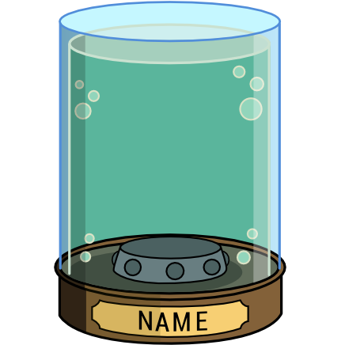

Head-In-Jar-Template
====================

An SVG with a Futurama-like jar for creating head-in-jar drawings. The jar looks as follows:

All you need to do is... well, draw the head :) The jar was created with Inkscape, and all the elements are grouped together. You can ungroup them (Ctrl+Shift+G) to change the name, the z-index of individual elements, etc. For example, when you add a drawing of a head, you can place it behind the front edges of the ellipses on the top.

License
=======

All files contained in this project are licensed under the DO-WHAT-THE-FUCK-YOU-WANT-TO-PUBLIC-LICENSE, Version 2 (http://www.wtfpl.net/). See the LICENSE file for more details.
